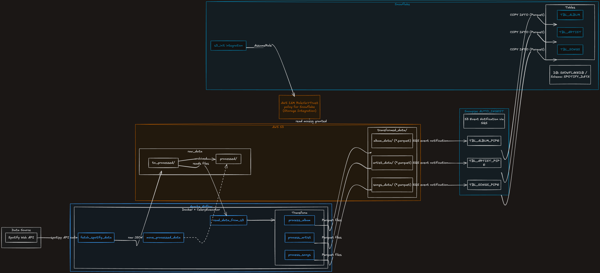
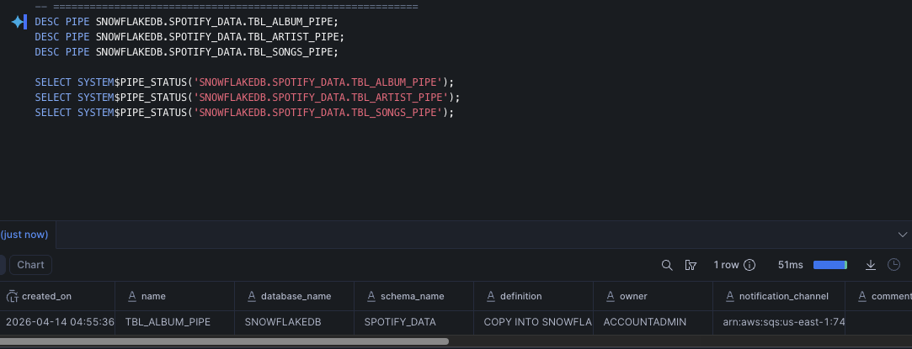
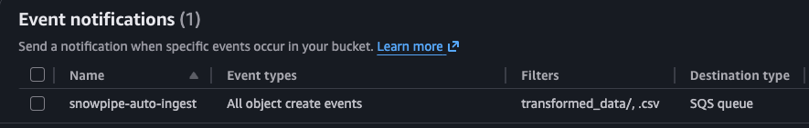

# Spotify ETL Pipeline — Apache Airflow + AWS S3

Production-grade ETL pipeline with fault-tolerant orchestration, parallel transforms, data quality validation, and Parquet output — migrated from a serverless Lambda architecture after hitting observability and dependency management limitations. See [DESIGN_DOC.md](DESIGN_DOC.md) for architectural decisions and root cause analysis of bugs fixed.

---

## Architecture

<p align="center">
  
</p>

---

## Airflow DAG Graph

<p align="center">
  
</p>

---

## How It Works

The pipeline runs on a daily schedule via an Airflow DAG with 10 tasks across 4 stages, followed by automated Snowflake loading via Snowpipe:

**1. Extract**
- Connects to the Spotify API using `spotipy` and pulls all tracks from a configured playlist
- Saves raw JSON locally in `/tmp` and uploads it to `s3://spotify-etl-pipeline-sumanth-dec25/raw_data/to_processed/`

**2. Read**
- Reads all raw JSON files from S3 and consolidates them to a `/tmp` file
- Pushes only the file path via XCom to keep the metadata DB lightweight

**3. Transform**
- Three parallel tasks process albums, artists, and songs independently
- Deduplicates records, parses dates, and validates data quality (null checks, duplicate checks, date validation)
- Writes each dataset as Parquet to `/tmp` and uploads to `s3://.../transformed_data/{album_data | artist_data | songs_data}/`

**4. Archive**
- Moves processed raw files from `raw_data/to_processed/` to `raw_data/processed/` and deletes the originals

**5. Load (Snowpipe — automatic)**
- Snowpipe watches the S3 `transformed_data/` prefixes via S3 event notifications (SQS)
- As soon as new files land in S3, Snowpipe auto-ingests them into `SNOWFLAKEDB.SPOTIFY_DATA` tables (`TBL_ALBUM`, `TBL_ARTIST`, `TBL_SONGS`)
- No manual trigger needed — the pipe runs continuously in the background

---

## DAG

<p align="center">
  
</p>

| Task | Type | Description |
|---|---|---|
| `fetch_spotify_data` | PythonOperator | Calls Spotify API, writes raw JSON to /tmp |
| `upload_raw_to_s3` | PythonOperator | Uploads raw JSON file to S3 |
| `read_data_from_s3` | PythonOperator | Reads all files from S3, consolidates to /tmp |
| `process_album` | PythonOperator | Extracts, deduplicates, and validates album records |
| `process_artist` | PythonOperator | Extracts, deduplicates, and validates artist records |
| `process_songs` | PythonOperator | Extracts, deduplicates, and validates song records |
| `store_album_to_s3` | PythonOperator | Uploads album Parquet to S3 |
| `store_artist_to_s3` | PythonOperator | Uploads artist Parquet to S3 |
| `store_songs_to_s3` | PythonOperator | Uploads songs Parquet to S3 |
| `move_processed_data` | PythonOperator | Archives raw JSON from to_processed → processed |

---

## S3 Bucket Structure

```
spotify-etl-pipeline-sumanth-dec25/
├── raw_data/
│   ├── to_processed/        ← raw JSON lands here
│   └── processed/           ← moved here after transformation
└── transformed_data/
    ├── album_data/          ← album Parquet files
    ├── artist_data/         ← artist Parquet files
    └── songs_data/          ← song Parquet files
```

<p align="center">
  
</p>

---

## Tech Stack

- **Orchestration:** Apache Airflow 3.x (CeleryExecutor + Redis)
- **Containerisation:** Docker + Docker Compose
- **Cloud Storage:** AWS S3
- **Data Warehouse:** Snowflake (Snowpipe for auto-ingest)
- **Language:** Python 3.12
- **Key Libraries:** `spotipy`, `pandas`, `pyarrow`, `apache-airflow-providers-amazon`
- **Data Source:** Spotify Web API

---

## Setup

### Prerequisites
- Docker and Docker Compose installed
- A Spotify Developer account
- An AWS account (free tier works)

### 1. Clone the repo

```bash
git clone https://github.com/sumanthmalipeddi/spotify-etl-aws-airflow.git
cd spotify-etl-aws-airflow
```

### 2. Create a Spotify App

1. Go to [Spotify Developer Dashboard](https://developer.spotify.com/dashboard)
2. Click **Create App**
3. Fill in any name and description, set redirect URI to `http://localhost`
4. Copy the **Client ID** and **Client Secret** — you'll need these in Step 5

### 3. Set up AWS S3 Bucket and IAM User

**Create an S3 Bucket:**
1. Go to AWS Console → S3 → **Create bucket**
2. Bucket name: pick any unique name (e.g. `spotify-etl-pipeline-yourname`)
3. Region: choose your preferred region
4. Leave all other settings as default → **Create bucket**

**Create an IAM User with S3 access:**
1. Go to AWS Console → IAM → Users → **Create user**
2. Username: `airflow-s3-user`
3. Click Next → Select **Attach policies directly**
4. Search and select `AmazonS3FullAccess` → Next → **Create user**
5. Click on the user → **Security credentials** tab → **Create access key**
6. Select **Third-party service** → confirm → Next → **Create access key**
7. Copy the **Access Key ID** and **Secret Access Key** — you'll need these in Step 6

> **Note:** If you use your own bucket name, you can either update the default in the code or set it via **Admin → Variables** with key `s3_bucket_name`. The pipeline checks Variables first and falls back to the default.

### 4. Start Airflow

```bash
docker-compose build
docker-compose up -d
```

Airflow UI will be available at `http://localhost:8080`
Default credentials: `airflow / airflow`

Wait 1-2 minutes for all services to become healthy. You can check with:

```bash
docker-compose ps
```

All services should show `(healthy)` status before proceeding.

### 5. Configure Airflow Variables

Go to **Admin → Variables** and add these two entries:

| Key | Value |
|---|---|
| `spotify_client_id` | Client ID from Step 2 |
| `spotify_client_secret` | Client Secret from Step 2 |

### 6. Configure AWS Connection

Go to **Admin → Connections → Add** (click the `+` button):

| Field | Value |
|---|---|
| Conn ID | `aws_s3_spotify` |
| Conn Type | `Amazon Web Services` |
| Login | Access Key ID from Step 3 |
| Password | Secret Access Key from Step 3 |

### 7. Trigger the DAG

1. Go to the **DAGs** page in Airflow UI
2. Find `spotify_etl_dag_airflow` and toggle it **ON**
3. Click the **play button** (trigger) to run it manually
4. Click on the DAG run to monitor task progress — all 10 tasks should turn green

---

## Snowflake Setup (Snowpipe)

All SQL for this section is in [`snowpipe.sql`](snowpipe.sql). Run the statements in order in a Snowflake worksheet.

### 1. Create database, schema, and tables

Run the `CREATE DATABASE`, `CREATE SCHEMA`, and all three `CREATE TABLE` statements. This sets up:
- `TBL_ALBUM` — album metadata
- `TBL_ARTIST` — artist metadata
- `TBL_SONGS` — song records with foreign keys to album and artist

### 2. Create the S3 Storage Integration

```sql
CREATE OR REPLACE STORAGE INTEGRATION s3_init
    TYPE = EXTERNAL_STAGE
    STORAGE_PROVIDER = 'S3'
    STORAGE_AWS_ROLE_ARN = 'arn:aws:iam::<your-aws-account-id>:role/<your-role-name>'
    ENABLED = TRUE
    STORAGE_ALLOWED_LOCATIONS = ('s3://<your-bucket>/transformed_data/');
```

Replace the ARN and bucket with your own values. Then run:
```sql
DESC INTEGRATION s3_init;
```

Copy the `STORAGE_AWS_IAM_USER_ARN` and `STORAGE_AWS_EXTERNAL_ID` values — you need these to configure the IAM role trust policy in AWS.

### 3. Create Stage and File Format

Run the `CREATE FILE FORMAT` and `CREATE STAGE` statements to point Snowflake at your S3 transformed data prefix.

### 4. Create the Snowpipes

Run the three `CREATE PIPE` statements. Then run:
```sql
DESC PIPE SNOWFLAKEDB.SPOTIFY_DATA.TBL_ALBUM_PIPE;
DESC PIPE SNOWFLAKEDB.SPOTIFY_DATA.TBL_ARTIST_PIPE;
DESC PIPE SNOWFLAKEDB.SPOTIFY_DATA.TBL_SONGS_PIPE;
```

Each pipe outputs a `notification_channel` — this is the **SQS ARN** you need in the next step.

<p align="center">
  
</p>

### 5. Configure S3 Event Notifications

For each of the three S3 prefixes (`album_data/`, `artist_data/`, `songs_data/`):

1. Go to your S3 bucket → **Properties** → **Event notifications** → **Create event notification**
2. Event types: select **All object create events**
3. Prefix: e.g. `transformed_data/album_data/`
4. Destination: **SQS queue** → paste the `notification_channel` ARN from Step 4

<p align="center">
  
</p>

### 6. Verify data is loading

After your Airflow pipeline runs and files land in S3, check pipe status and row counts:

```sql
SELECT SYSTEM$PIPE_STATUS('SNOWFLAKEDB.SPOTIFY_DATA.TBL_ALBUM_PIPE');
SELECT COUNT(*) AS album_count  FROM SNOWFLAKEDB.SPOTIFY_DATA.TBL_ALBUM;
SELECT COUNT(*) AS artist_count FROM SNOWFLAKEDB.SPOTIFY_DATA.TBL_ARTIST;
SELECT COUNT(*) AS songs_count  FROM SNOWFLAKEDB.SPOTIFY_DATA.TBL_SONGS;
```

<p align="center">
  
</p>

---

## Output

<p align="center">
  
</p>

Three Parquet files are produced per run, timestamped and stored in separate S3 prefixes:

- `album_transformed_<timestamp>.parquet` — album ID, name, release date, total tracks, URL
- `artist_transformed_<timestamp>.parquet` — artist ID, name, external URL
- `songs_transformed_<timestamp>.parquet` — song ID, name, duration, popularity, added date, album ID, artist ID

---

## Troubleshooting

| Issue | Fix |
|---|---|
| Tasks fail with `Signature verification failed` | Run `docker-compose down -v && docker-compose up -d` to regenerate the shared config |
| Tasks fail with `Network is unreachable` | Your Docker containers have no internet. Restart Docker Desktop and try again |
| `Variable not found` error | Make sure you added both Spotify variables in **Admin → Variables** (Step 5) |
| S3 access denied | Verify the AWS Connection credentials in **Admin → Connections** (Step 6) and that your IAM user has `AmazonS3FullAccess` |
| DAG not visible in UI | Wait 1-2 minutes for the DAG processor to parse the file. Check `docker-compose ps` for healthy services |

> **Note:** The `config/` directory is auto-generated on first run by Airflow and contains an `airflow.cfg` with auto-generated secrets. It is gitignored and should not be committed. If you run into auth issues, delete it and restart: `rm -rf config/ && docker-compose down -v && docker-compose up -d`

---

## Project History

This project evolved through three phases:

1. **Phase 1 — Serverless:** AWS Lambda + CloudWatch for extraction and transformation. Hit limitations with observability, dependency management, and debugging. Original files preserved on the [`phase1-lambda`](https://github.com/sumanthmalipeddi/spotify-etl-aws-airflow/tree/phase1-lambda) branch.
2. **Phase 2 — Airflow:** Migrated to Airflow 3.x with CeleryExecutor for DAG-based orchestration, parallel transforms, retry logic, and a unified monitoring UI.
3. **Phase 3 — Snowflake:** Added Snowpipe auto-ingest to load transformed S3 data directly into Snowflake tables for analytics and querying.

See [DESIGN_DOC.md](DESIGN_DOC.md) for the full architecture evolution and trade-off analysis.
